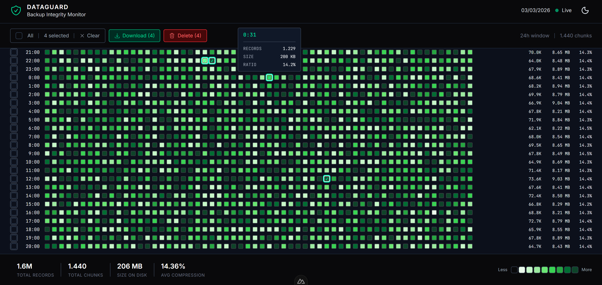
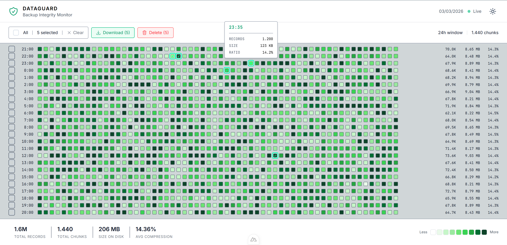

# DataGuard Backup Integrity Monitor

A single-page dashboard for visualizing and managing 1,440 daily backup chunks across a 24-hour window.

Built as part of a frontend technical assessment.

---

## Tech Stack

- **Nuxt 4** — App directory structure, file-based routing
- **Nuxt UI 4** — Component library with dark/light mode support
- **Pinia 3** — State management
- **TypeScript** — Type safety across components, store, and API routes
- **Tailwind CSS v4** — Utility-first styling
- **Vitest** — Unit testing

---

## Preview




---

## Getting Started

### Prerequisites

- Node.js 20+
- npm

### Installation
```bash
# Clone the repository
git clone <repo-url>
cd frontend-challenge-1

# Generate mock data
node generate-mock-data.mjs

# Install dependencies
cd backup-dashboard
npm install

# Start development server
npm run dev
```

Open [http://localhost:3000](http://localhost:3000)

### Run Tests
```bash
npm run test
```

### Tests
Unit tests are written with Vitest and cover the core composables.

**useColorMap**

| Test Description | Input / Condition | Expected Result  |
| ---------------- | ----------------- | ---------------- |
| Zero dataCount   | 0                 | Level 0          |
| Min equals max   | min = max         | Middle level (4) |
| Minimum value    | min value         | Level 0          |
| Maximum value    | max value         | Level 8          |


**useFormatters**

| Test Description | Input / Condition | Expected Result |
| ---------------- | ----------------- | --------------- |
| Bytes            | 500               | 500 B           |
| Kilobytes        | 2048              | 2 KB            |
| Megabytes        | 1,048,576         | 1.00 MB         |
| Small count      | 500               | "500"           |
| Thousands        | 1,500             | "1.5K"          |
| Millions         | 2,000,000         | "2.0M"          |

---

## Project Structure
```
backup-dashboard/
├── app/
│   ├── assets/css/
│   ├── components/
│   │   ├── layout/
│   │   │   ├── AppHeader.vue     # Top navigation with dark/light toggle
│   │   │   ├── AppToolbar.vue    # Selection controls and action buttons
│   │   │   └── AppFooter.vue     # Statistics and color scale legend
│   │   ├── ChunkGrid.vue         # 24-hour heatmap grid
│   │   ├── ChunkCell.vue         # Single minute chunk cell with tooltip
│   │   ├── DeleteModal.vue
│   │   └── DownloadModal.vue
│   ├── composables/
│   │   ├── useColorMap.ts        # Maps dataCount to color levels
│   │   ├── useFormatters.ts      # Size and count formatting utilities
│   │   └── useChunkStats.ts      # Aggregated statistics from store
│   ├── layouts/
│   │   └── default.vue
│   ├── pages/
│   │   └── index.vue
│   ├── stores/
│   │   └── chunks.ts             # Pinia store for chunk data and selection
│   ├── tests/
│   │   ├── useColorMap.test.ts
│   │   └── useFormatters.test.ts
│   ├── types/
│   │   └── index.ts              # TypeScript interfaces and enums
│   └── app.vue
├── docs/
│   ├── dark-mode.png
│   └── light-mode.png
├── server/
│   └── api/
└── mock-data/                    # Generated JSON data files
```

---

## Architecture Decisions

**Component hierarchy** — Grid is broken into `ChunkGrid → HourRow → ChunkCell` for clear separation of concerns. Each component handles its own level of data.

**Pinia store** — All selection state lives in the store. Components emit events upward, store manages state. This keeps components stateless and testable.

**Composables** — Formatting logic (`useFormatters`) and statistics (`useChunkStats`) are extracted into composables to avoid duplication across components.

**Mock API** — Server routes in `server/api/` simulate real endpoints. Data is read from `mock-data/` JSON files. No actual deletion occurs.

**Color mapping** — `useColorMap` uses linear scaling between `minDataCount` and `maxDataCount` from the API response to assign one of 8 color levels to each chunk.

---

## Features

- Heatmap visualization of 1,440 backup chunks (24h × 60min)
- Click individual chunks or use row checkboxes to select
- Select all / deselect all
- Download modal with signed URLs for selected chunks
- Delete modal with confirmation flow
- Footer statistics: total records, chunks, disk size, compression ratio
- Color scale legend
- Dark / light mode toggle
- Responsive layout with horizontal scroll on small screens